# Golem

[](https://github.com/strings77wzq/golem/actions/workflows/ci.yml)
[](https://goreportcard.com/report/github.com/strings77wzq/golem)
[](https://opensource.org/licenses/MIT)
[](https://go.dev/)
[](https://github.com/strings77wzq/golem/releases)
[](https://github.com/strings77wzq/golem/actions)
[](https://github.com/strings77wzq/golem)

> **Let AI see your data.**

Golem is a Go-native database AI agent. It connects to your databases, understands table schemas, and exposes query capabilities to Claude Code, Cursor, or any MCP-compatible agent via the Model Context Protocol.

**Zero Python. Zero Docker. Zero dependencies.** Download a 14MB binary, point it at your database, and start querying.

---

## Why Golem?

If you use AI agents (Claude Code, Cursor, OpenClaw), you've hit a common problem: **they can't see your data.**

You can ask AI to write code, read files, execute commands — but it can't directly query your SQLite database to answer "how many users signed up last month?"

```
Your Database (SQLite / PostgreSQL / MySQL / Redis / Qdrant)
        │
        ▼
┌─────────────────┐
│  Golem Agent    │  ← Connects to DB, understands schema
│  (14MB binary)  │
└────────┬────────┘
         │ MCP Protocol
         ▼
┌─────────────────┐
│  Claude Code    │
│  Cursor         │  ← Queries data via sql_query tool
│  Any MCP client │
└─────────────────┘
```

---

## Quick Start (5 minutes)

```bash
# 1. Install
go install github.com/strings77wzq/golem/cmd/golem@latest

# 2. Create demo database
golem demo-db

# 3. Let the agent analyze your data
golem agent --db .golem-demo.db -m "What tables exist? Any performance issues?"
```

---

## Core Features

### Database Intelligence

```bash
# Connect to database, query with natural language
golem agent --db ./myapp.db -m "Show me users registered in the last 7 days"

# Analyze table structure
golem agent --db ./myapp.db -m "Check if orders table indexes are optimal"

# Find performance issues
golem agent --db ./myapp.db -m "What needs optimization in this database?"
```

### Safety Model

| Operation | Default | With Permission |
|-----------|---------|-----------------|
| SELECT queries | ✅ Allowed | ✅ |
| INSERT/UPDATE | ❌ Blocked | ✅ (requires WHERE) |
| DELETE | ❌ Blocked | ✅ (requires WHERE) |
| Shell commands | ⚠️ Allowlist only | ✅ |

- **PermissionChecker** — operation-level access control
- **QualityGate** — WHERE clause enforcement
- **Rollback SQL** — auto-generated for DELETE/UPDATE
- **Audit logging** — all operations traceable

### MCP Server — Let Other Agents Query Your Database

```bash
golem mcp-server --db ./myapp.db
```

Add to Claude Code's MCP config:

```json
{
  "golem": {
    "command": "golem",
    "args": ["mcp-server", "--db", "./myapp.db"]
  }
}
```

### HTTP Gateway — OpenAI-Compatible API

```bash
golem gateway    # Starts on :18790
```

```bash
curl http://localhost:18790/v1/chat/completions \
  -H "Content-Type: application/json" \
  -d '{"messages":[{"role":"user","content":"List all admins"}]}'
```

### YAML Declarative Configuration

```yaml
# agent.yaml (v2)
version: 2
agent:
  model: openai/gpt-4o
  fallback_models:
    - anthropic/claude-3-haiku
  system_prompt: |
    You are a database assistant. Help users query their data.
  max_tokens: 8192
  commands:
    schema: "Analyze the database schema and list all tables"
    optimize: "Review the last query and suggest optimizations"
database:
  path: ./myapp.db
tools:
  - type: database
    path: ./myapp.db
  - type: mcp
    command: npx
    args: ["-y", "@modelcontextprotocol/server-duckduckgo"]
  - type: memory
    path: ./memory.db
hooks:
  pre_tool_use:
    command: ./scripts/validate.sh
```

```bash
golem agent --config agent.yaml
```

### Debug & Validation Commands

```bash
golem debug tools      # List all registered tools
golem debug config     # Show parsed config (API keys masked)
golem config validate  # Validate config file
golem status           # Show system status with tools and features
```

### Provider Fallback — Automatic Failover

If the primary model is unavailable, Golem automatically tries fallback models with exponential backoff:

```yaml
agent:
  model: openai/gpt-4o
  fallback_models:
    - anthropic/claude-3-haiku
    - ollama/qwen3
```

### TUI Slash Commands

| Command | Description |
|---------|-------------|
| `/tools` | List available tools |
| `/new` | Start a new session |
| `/sessions` | Browse past sessions |
| `/model` | Switch the current model |
| `/compact` | Compact conversation history (LLM-driven) |
| `/clear` | Clear conversation history |
| `/fork` | Fork the current session |
| `/help` | Show available commands |
| `/quit` | Exit the application |

---

## Architecture

```mermaid
graph TB
    subgraph "cmd/golem/ Composition Root"
        CLI[CLI Entry]
        Debug[debug tools/config]
        Status[status]
        Validate[config validate]
        Init[init wizard]
    end

    subgraph "internal/wiring/ Dependency Creation"
        Wiring[Provider Registry]
        ToolWiring[Tool Registration]
    end

    subgraph "core/ Domain Logic"
        Agent[agent/<br/>ReAct Loop]
        Compactor[compactor.go<br/>LLM Compaction]
        Streaming[streaming.go<br/>Streaming Output]
        Providers[providers/<br/>8 LLMs + Retry]
        Registry[registry.go<br/>Provider Registry]
        Tools[tools/<br/>12 Tools]
        Session[session/<br/>Session Management]
        Context[context/<br/>Context Management]
        Bus[bus/<br/>Message Bus]
    end

    subgraph "feature/ Optional Modules"
        Config[config/<br/>YAML v2]
        RAG[rag/<br/>BM25+RRF]
        MCP[mcp/<br/>MCP Protocol]
        Skills[skills/<br/>Skill Registry]
        Memory[memory/<br/>Long-term Memory]
    end

    subgraph "internal/ Internal Adapters"
        TUI[TUI/<br/>Bubble Tea]
        CLI_Ch[CLI/<br/>readline]
        TG[Telegram/<br/>Bot Adapter]
        Gateway[Gateway/<br/>HTTP API]
        Metrics[Metrics/<br/>Prometheus]
        Security[Security/<br/>Auth/Rate Limit]
    end

    subgraph "foundation/ Infrastructure Primitives"
        Concurrency[concurrency/<br/>Concurrency Primitives]
        Logger[logger/<br/>Structured Logging]
        Store[store/<br/>SQLite Persistence]
        Term[term/<br/>Terminal Detection]
    end

    CLI --> Wiring
    Debug --> ToolWiring
    Status --> ToolWiring
    Validate --> Config
    Init --> Config

    Wiring --> Providers
    Wiring --> Registry
    ToolWiring --> Tools

    Agent --> Context
    Agent --> Providers
    Agent --> Tools
    Agent --> Session
    Agent --> Bus
    Agent --> Compactor
    Agent --> Streaming

    Compactor --> Providers
    Streaming --> Providers

    TUI --> Bus
    CLI_Ch --> Bus
    TG --> Bus
    Gateway --> Bus

    Config --> Context
    RAG --> Tools
    MCP --> Tools

    Session --> Store
    Logger --> Term

    style cmd fill:#e1f5fe
    style wiring fill:#f3e5f5
    style core fill:#e8f5e9
    style feature fill:#fff3e0
    style internal fill:#fce4ec
    style foundation fill:#f5f5f5
```



**Dependency direction:**
```
cmd/ → internal/wiring/ → core/*, feature/*
cmd/ → internal/* → core/*
foundation/ → stdlib only (zero project dependencies)
```

---

## Supported LLM Providers

| Provider | Local/Cloud | Notes |
|----------|-------------|-------|
| Ollama | Local | Fully offline |
| OpenAI | Cloud | GPT-4o, GPT-4 |
| Anthropic | Cloud | Claude 3.5 Sonnet |
| DeepSeek | Cloud | DeepSeek Chat |
| MiMo | Cloud | Xiaomi MiMo |
| Kimi | Cloud | Moonshot |
| GLM | Cloud | Zhipu |
| MiniMax | Cloud | MiniMax |
| Qwen | Cloud | Tongyi Qianwen |

Also supports any OpenAI-compatible API (vLLM, OpenRouter, LiteLLM).

---

## Gateway API

| Method | Path | Description |
|--------|------|-------------|
| GET | `/health` | Health check |
| GET | `/metrics` | Prometheus metrics |
| POST | `/api/chat` | Synchronous chat |
| POST | `/api/chat/stream` | SSE streaming chat |
| POST | `/v1/chat/completions` | OpenAI-compatible API |
| GET | `/v1/models` | List available models |
| GET | `/api/sessions/{id}/export` | Export session |
| POST | `/api/sessions/import` | Import session |

---

## Testing

```bash
go test ./...                    # 41 packages
go test -race ./...              # Race detector
go test -coverprofile=out ./...  # Coverage
```

---

## Contributing

See [CONTRIBUTING.md](CONTRIBUTING.md) for guidelines.

Core principles:
- `CGO_ENABLED=0` is mandatory
- Layer boundaries must be strict (cmd → wiring → core → foundation)
- Every PR needs tests
- Use Conventional Commits format

---

## License

MIT License

---

## Acknowledgments

- Design inspired by [PicoClaw](https://github.com/sipeed/picoclaw) by Sipeed
- Architecture reference: Docker Agent's declarative configuration approach

---

## 中文说明

[English](#golem) | **中文**

Golem 是一个 Go 原生的数据库 AI Agent。它连接你的数据库，理解表结构，然后通过 MCP 协议把查询能力暴露给 Claude Code、Cursor 或任何支持 MCP 的 AI agent。

### 核心优势

- **数据库安全模型** — 默认只读，写操作需要 WHERE 子句，自动生成回滚 SQL
- **零依赖单二进制** — 14MB，支持 Linux/macOS/Android Termux
- **严格分层架构** — Go import 系统强制执行，不是文档约定
- **LLM KV-Cache 优化** — 工具按字母序排列，最大化缓存复用
- **9 家国产模型** — DeepSeek、Kimi、GLM、MiniMax、Qwen、MiMo 开箱即用
- **消息总线解耦** — TUI/Gateway/Telegram 通道独立演进
- **LLM 驱动压缩** — 替代简单截断，保留对话上下文
- **BM25 + 向量混合检索** — 支持中英文，RRF 融合排序

### 快速开始

```bash
go install github.com/strings77wzq/golem/cmd/golem@latest
golem demo-db
golem agent --db .golem-demo.db -m "分析这个数据库"
```

详细文档请参考 [docs/](docs/) 目录。
