# Golem

[](https://github.com/strings77wzq/golem/actions/workflows/ci.yml)
[](https://goreportcard.com/report/github.com/strings77wzq/golem)
[](https://opensource.org/licenses/MIT)
[](https://go.dev/)
[](https://github.com/strings77wzq/golem/releases)
[](https://github.com/strings77wzq/golem/actions)
[](https://github.com/strings77wzq/golem)

> **让 AI 看到你的数据。**

Golem 是一个 Go 原生的数据库 AI Agent。它连接你的数据库，理解表结构，然后通过 MCP 协议把查询能力暴露给 Claude Code、Cursor 或任何支持 MCP 的 AI agent。

**零 Python、零 Docker、零依赖。** 下载一个 14MB 的二进制文件，指向你的数据库，开始查询。

---

## 为什么需要 Golem？

如果你在使用 AI agent（Claude Code、Cursor、OpenClaw），你一定遇到过这个问题：**它们看不到你的数据。**

你可以让 AI 写代码、读文件、执行命令 — 但它无法直接查询你的 SQLite 数据库来回答"上个月有多少用户注册？"

```
你的数据库 (SQLite / PostgreSQL / MySQL / Redis / Qdrant)
        │
        ▼
┌─────────────────┐
│  Golem Agent    │  ← 连接数据库，理解 schema
│  (14MB 单二进制) │
└────────┬────────┘
         │ MCP 协议
         ▼
┌─────────────────┐
│  Claude Code    │
│  Cursor         │  ← 通过 sql_query 工具查询数据
│  任何 MCP 客户端  │
└─────────────────┘
```

---

## 快速开始（5 分钟）

```bash
# 1. 安装
go install github.com/strings77wzq/golem/cmd/golem@latest

# 2. 创建演示数据库
golem demo-db

# 3. 让 agent 分析你的数据
golem agent --db .golem-demo.db -m "有哪些表？性能有问题吗？"
```

---

## 核心特性

### 数据库智能

```bash
# 连接数据库，用自然语言查询
golem agent --db ./myapp.db -m "显示最近 7 天注册的用户"

# 分析表结构
golem agent --db ./myapp.db -m "检查 orders 表的索引是否优化"

# 发现性能问题
golem agent --db ./myapp.db -m "这个数据库有什么需要优化的地方？"
```

### 安全模型

| 操作 | 默认 | 授权后 |
|------|------|--------|
| SELECT 查询 | ✅ 允许 | ✅ |
| INSERT/UPDATE | ❌ 阻止 | ✅（需要 WHERE） |
| DELETE | ❌ 阻止 | ✅（需要 WHERE） |
| Shell 命令 | ⚠️ 仅允许列表 | ✅ |

- **PermissionChecker** — 操作级访问控制
- **QualityGate** — WHERE 子句强制
- **Rollback SQL** — DELETE/UPDATE 自动生成回滚语句
- **审计日志** — 所有操作可追溯

### MCP Server — 让其他 Agent 查询你的数据库

```bash
golem mcp-server --db ./myapp.db
```

添加到 Claude Code 的 MCP 配置：

```json
{
  "golem": {
    "command": "golem",
    "args": ["mcp-server", "--db", "./myapp.db"]
  }
}
```

### HTTP Gateway — OpenAI 兼容 API

```bash
golem gateway    # 启动在 :18790
```

```bash
curl http://localhost:18790/v1/chat/completions \
  -H "Content-Type: application/json" \
  -d '{"messages":[{"role":"user","content":"列出所有管理员"}]}'
```

### YAML 声明式配置

```yaml
# agent.yaml (v2)
version: 2
agent:
  model: openai/gpt-4o
  fallback_models:
    - anthropic/claude-3-haiku
  system_prompt: |
    你是一个数据库助手，帮助用户查询和分析数据。
  max_tokens: 8192
  commands:
    schema: "分析数据库结构并列出所有表"
    optimize: "审查最后一条查询并建议优化"
database:
  path: ./myapp.db
tools:
  - type: database
    path: ./myapp.db
  - type: mcp
    command: npx
    args: ["-y", "@modelcontextprotocol/server-duckduckgo"]
  - type: memory
    path: ./memory.db
hooks:
  pre_tool_use:
    command: ./scripts/validate.sh
```

```bash
golem agent --config agent.yaml
```

### 调试与验证

```bash
golem debug tools      # 列出所有工具
golem debug config     # 显示配置（API key 已遮盖）
golem config validate  # 验证配置文件
golem status           # 显示系统状态
```

### Provider 故障转移

主模型不可用时自动切换备选模型，支持指数退避重试：

```yaml
agent:
  model: openai/gpt-4o
  fallback_models:
    - anthropic/claude-3-haiku
    - ollama/qwen3
```

### TUI 斜杠命令

| 命令 | 说明 |
|------|------|
| `/tools` | 列出可用工具 |
| `/new` | 新建会话 |
| `/sessions` | 浏览历史会话 |
| `/model` | 切换模型 |
| `/compact` | 压缩会话历史（LLM 驱动） |
| `/clear` | 清空会话历史 |
| `/fork` | 分叉当前会话 |
| `/help` | 显示帮助 |
| `/quit` | 退出 |

---

## 架构

```mermaid
graph TB
    subgraph "cmd/golem/ 组合根"
        CLI[CLI 入口]
        Debug[debug tools/config]
        Status[status]
        Validate[config validate]
        Init[init 向导]
    end

    subgraph "internal/wiring/ 依赖创建"
        Wiring[Provider Registry]
        ToolWiring[工具注册]
    end

    subgraph "core/ 核心领域逻辑"
        Agent[agent/<br/>ReAct 循环]
        Compactor[compactor.go<br/>LLM 压缩]
        Streaming[streaming.go<br/>流式输出]
        Providers[providers/<br/>8家 LLM + 重试]
        Registry[registry.go<br/>Provider 注册表]
        Tools[tools/<br/>12 种工具]
        Session[session/<br/>会话管理]
        Context[context/<br/>上下文管理]
        Bus[bus/<br/>消息总线]
    end

    subgraph "feature/ 可选功能模块"
        Config[config/<br/>YAML v2]
        RAG[rag/<br/>BM25+RRF]
        MCP[mcp/<br/>MCP 协议]
        Skills[skills/<br/>技能注册表]
        Memory[memory/<br/>长期记忆]
    end

    subgraph "internal/ 内部适配器"
        TUI[TUI/<br/>Bubble Tea]
        CLI_Ch[CLI/<br/>readline]
        TG[Telegram/<br/>Bot 适配器]
        Gateway[Gateway/<br/>HTTP API]
        Metrics[Metrics/<br/>Prometheus]
        Security[Security/<br/>Auth/限流]
    end

    subgraph "foundation/ 基础设施原语"
        Concurrency[concurrency/<br/>并发原语]
        Logger[logger/<br/>结构化日志]
        Store[store/<br/>SQLite 持久化]
        Term[term/<br/>终端检测]
    end

    CLI --> Wiring
    Debug --> ToolWiring
    Status --> ToolWiring
    Validate --> Config
    Init --> Config

    Wiring --> Providers
    Wiring --> Registry
    ToolWiring --> Tools

    Agent --> Context
    Agent --> Providers
    Agent --> Tools
    Agent --> Session
    Agent --> Bus
    Agent --> Compactor
    Agent --> Streaming

    Compactor --> Providers
    Streaming --> Providers

    TUI --> Bus
    CLI_Ch --> Bus
    TG --> Bus
    Gateway --> Bus

    Config --> Context
    RAG --> Tools
    MCP --> Tools

    Session --> Store
    Logger --> Term

    style cmd fill:#e1f5fe
    style wiring fill:#f3e5f5
    style core fill:#e8f5e9
    style feature fill:#fff3e0
    style internal fill:#fce4ec
    style foundation fill:#f5f5f5
```



**依赖方向：**
```
cmd/ → internal/wiring/ → core/*, feature/*
cmd/ → internal/* → core/*
foundation/ → stdlib only（零项目依赖）
```

---

## 支持的 LLM 提供商

| 提供商 | 本地/云 | 说明 |
|--------|---------|------|
| Ollama | 本地 | 完全离线 |
| OpenAI | 云 | GPT-4o, GPT-4 |
| Anthropic | 云 | Claude 3.5 Sonnet |
| DeepSeek | 云 | DeepSeek Chat |
| MiMo | 云 | 小米 MiMo |
| Kimi | 云 | Moonshot |
| GLM | 云 | 智谱 |
| MiniMax | 云 | MiniMax |
| Qwen | 云 | 通义千问 |

支持任何 OpenAI 兼容 API（vLLM, OpenRouter, LiteLLM）。

---

## Gateway API

| 方法 | 路径 | 说明 |
|------|------|------|
| GET | `/health` | 健康检查 |
| GET | `/metrics` | Prometheus 指标 |
| POST | `/api/chat` | 同步聊天 |
| POST | `/api/chat/stream` | SSE 流式聊天 |
| POST | `/v1/chat/completions` | OpenAI 兼容 API |
| GET | `/v1/models` | 列出可用模型 |
| GET | `/api/sessions/{id}/export` | 导出会话 |
| POST | `/api/sessions/import` | 导入会话 |

---

## 测试

```bash
go test ./...                    # 41 个包
go test -race ./...              # 竞态检测
go test -coverprofile=out ./...  # 覆盖率
```

---

## 贡献

详见 [CONTRIBUTING.md](CONTRIBUTING.md)。

核心原则：
- `CGO_ENABLED=0` 强制执行
- 严格分层架构（cmd → wiring → core → foundation）
- 每个 PR 需要测试
- 使用 Conventional Commits 格式

---

## 许可证

MIT License

---

## 致谢

- 设计灵感来自 [PicoClaw](https://github.com/sipeed/picoclaw) by Sipeed
- 架构参考 Docker Agent 的声明式配置理念

---

## 中文说明

Golem 是一个 Go 原生的数据库 AI Agent。它连接你的数据库，理解表结构，然后通过 MCP 协议把查询能力暴露给 Claude Code、Cursor 或任何支持 MCP 的 AI agent。

### 核心优势

- **数据库安全模型** — 默认只读，写操作需要 WHERE 子句，自动生成回滚 SQL
- **零依赖单二进制** — 14MB，支持 Linux/macOS/Android Termux
- **严格分层架构** — Go import 系统强制执行，不是文档约定
- **LLM KV-Cache 优化** — 工具按字母序排列，最大化缓存复用
- **9 家国产模型** — DeepSeek、Kimi、GLM、MiniMax、Qwen、MiMo 开箱即用
- **消息总线解耦** — TUI/Gateway/Telegram 通道独立演进
- **LLM 驱动压缩** — 替代简单截断，保留对话上下文
- **BM25 + 向量混合检索** — 支持中英文，RRF 融合排序

### 快速开始

```bash
go install github.com/strings77wzq/golem/cmd/golem@latest
golem demo-db
golem agent --db .golem-demo.db -m "分析这个数据库"
```

详细文档请参考 [docs/](docs/) 目录。
