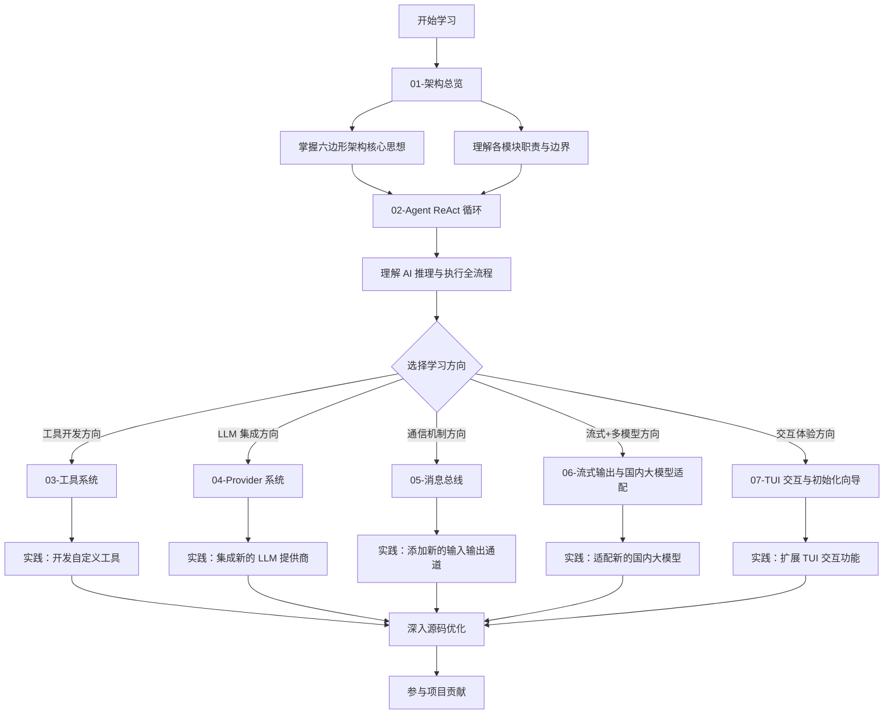

# Golem 学习指南

欢迎使用 Golem 项目学习指南！本指南面向中级 Go 开发者，旨在帮助您系统掌握 AI 助手的架构设计思想与核心实现细节。

## 项目概述

**Golem** 是一款纯 Go 实现的轻量 AI Agent 框架，设计灵感源自 PicoClaw（sipeed/picoclaw）。项目采用六边形架构（Hexagonal Architecture）与依赖注入模式，为开发者展示了如何构建模块化、高可测、易扩展的生产级 AI 助手系统。

### 核心特性

- **ReAct 推理循环**：实现 Reason + Act 双模工作流，支持 AI 自主推理与工具调用
- **消息总线架构**：基于 Pub/Sub 模式实现组件完全解耦
- **可扩展工具系统**：支持动态注册、插拔式工具扩展机制
- **多 LLM 提供商抽象**：统一适配 OpenAI、Anthropic 等主流大模型厂商
- **线程安全会话管理**：支持对话状态持久化与多并发访问
- **全链路依赖注入**：清晰的依赖关系，保障代码可测试性与可维护性
- **流式响应输出**：支持 OpenAI、Anthropic 等厂商的 SSE 逐 Token 流式响应
- **国内大模型原生支持**：深度适配 DeepSeek、Moonshot/Kimi、智谱 GLM、MiniMax、通义千问等国内主流大模型
- **会话断点恢复**：通过 `-C` 参数快速恢复上次对话或指定历史会话
- **Token 用量可视化**：内置 25+ 模型定价规则，实时展示 Token 消耗与预估成本

### 与 PicoClaw 的架构差异

PicoClaw 是基于 Python 实现的 AI 助手框架。Golem 借鉴了其核心设计理念，同时结合 Go 语言特性进行了全面架构优化：

- 采用强类型接口设计，保障代码健壮性
- 通过消息总线实现组件间完全解耦
- 原生支持并发安全，适配高并发场景
- 采用严格的四层分层架构，边界清晰

## 指南使用说明

### 推荐阅读顺序

建议按照从宏观到微观的顺序逐步学习，先建立全局认知，再深入细节实现：

1. **[架构总览](./01-architecture-overview.md)** - 掌握整体分层架构与各模块核心职责
2. **[Agent ReAct 循环](./02-agent-react-loop.md)** - 理解 AI 推理与工具执行的核心工作流
3. **[工具系统](./03-tool-system.md)** - 学习工具接口定义、注册与执行机制
4. **[Provider 系统](./04-provider-system.md)** - 掌握 LLM 提供商抽象层的设计与实现
5. **[消息总线](./05-message-bus.md)** - 了解组件间异步通信的实现原理
6. **[流式输出与国内大模型适配](./06-streaming-and-providers.md)** - 掌握流式响应实现与多厂商适配方案
7. **[TUI 交互与初始化向导](./07-tui-channel.md)** - 学习 Bubble Tea Elm 架构、递归 Cmd 流式渲染与 Termux 兼容性设计

每篇文档均包含以下内容：
- 核心设计思想与架构决策背景
- 关键代码片段逐行解析
- Mermaid 可视化架构图
- 可直接运行的代码示例

### 前置知识准备

学习本指南前，建议您具备以下基础：

- **Go 语言基础**：熟悉 Go 语法、接口、goroutine、channel 等核心特性
- **并发编程基础**：理解互斥锁（Mutex）、读写锁（RWMutex）的使用场景
- **设计模式基础**：了解依赖注入、工厂模式、观察者模式的核心思想
- **AI 基础概念**：了解 LLM（大语言模型）、Tool Calling（工具调用）的基本概念

### 高效学习建议

1. **结合源码阅读**：建议同时打开项目源码，对照文档逐行理解实现细节
2. **通过测试理解用法**：每个模块都提供了完善的单元测试，可通过运行测试快速掌握接口使用方式
3. **动手实践验证**：尝试实现自定义工具或集成新的 LLM 提供商，在实践中加深理解
4. **可视化总结**：学习过程中尝试自行绘制架构图，巩固对模块关系的认知

## 项目结构总览

```
Golem/
├── cmd/                          # 组合根（Composition Root）
│   └── golem/                    # CLI 主程序入口，负责依赖组装
├── core/                         # 核心领域逻辑层
│   ├── agent/                    # ReAct 推理循环核心实现
│   ├── bus/                      # 消息总线（Pub/Sub 模式）
│   ├── config/                   # 配置加载与管理
│   ├── providers/                # LLM 提供商抽象层
│   ├── session/                  # 会话状态管理
│   ├── tools/                    # 工具接口定义与注册表
│   └── usage/                    # Token 用量追踪与定价
├── foundation/                   # 基础设施原语层
│   ├── concurrency/              # 并发原语（池、信号量、限流器）
│   ├── logger/                   # 结构化日志实现
│   ├── store/                    # SQLite 持久化层（纯 Go 实现）
│   └── term/                     # 终端环境检测
├── feature/                      # 可选功能模块层
│   ├── mcp/                      # MCP 协议客户端实现
│   ├── memory/                   # 长期记忆模块（带重要性衰减）
│   ├── rag/                      # RAG 检索增强生成管线
│   ├── routing/                  # 错误处理与降级路由
│   └── skills/                   # 技能注册表与内置技能
├── internal/                     # 内部适配层（仅供本项目使用）
│   ├── channels/                 # I/O 适配器（CLI、Telegram 等）
│   ├── gateway/                  # HTTP 网关（支持 SSE 流式输出）
│   ├── metrics/                  # Prometheus 兼容指标暴露
│   └── security/                 # 认证、限流、沙箱安全模块
├── config/                       # 配置文件目录
├── docs/                         # 项目文档
│   └── study/                    # 本学习指南
└── scripts/                      # 构建与运维工具脚本
```

## 核心概念速查

### ReAct 模式

ReAct = **Rea**son（推理） + A**ct**（行动），是当前主流的 Agent 工作模式：
1. **推理阶段**：AI 分析用户问题，决策是否需要调用工具以及调用哪些工具
2. **行动阶段**：执行工具调用，获取返回结果
3. **循环迭代**：将工具结果注入上下文，继续推理，直到生成最终答案

### 六边形架构

又称端口-适配器架构（Ports and Adapters），核心设计思想是实现业务逻辑与外部依赖的完全解耦：
- **核心层**：业务逻辑完全不依赖外部系统，仅依赖抽象接口
- **端口层**：定义核心与外部交互的接口契约，不关心具体实现
- **适配层**：实现端口接口，对接具体外部系统（数据库、API、终端等）

### 消息总线

基于 Pub/Sub 模式的异步事件总线，实现消息发送方与接收方的完全解耦：
- **发布者**：仅负责发布消息到指定主题，不关心消息接收方
- **订阅者**：仅订阅感兴趣的主题，接收并处理相关消息
- **核心优势**：组件间零依赖，易于测试、扩展与维护

## 快速上手

### 项目构建

```bash
# 进入项目根目录
cd golem
# 构建纯 Go 静态二进制
CGO_ENABLED=0 go build -ldflags "-s -w" -o build/golem ./cmd/golem
```

### 测试运行

```bash
# 运行全量单元测试
go test ./...

# 运行指定模块测试
go test ./core/bus/
go test ./core/tools/
```

### 功能查看

```bash
# 查看全局帮助
./build/golem --help
# 查看 Agent 命令帮助
./build/golem agent --help
```

## 学习路径指引



## 扩展阅读推荐

- **Go 并发模式官方指南**：[Go Concurrency Patterns](https://go.dev/blog/pipelines)
- **六边形架构核心思想**：[Hexagonal Architecture](https://alistair.cockburn.us/hexagonal-architecture/)
- **ReAct 模式原始论文**：[ReAct: Synergizing Reasoning and Acting in Language Models](https://arxiv.org/abs/2210.03629)

## 问题反馈与贡献

学习过程中遇到问题或发现文档错误，欢迎通过以下方式反馈：
- 提交 GitHub Issue
- 提交 Pull Request 修复问题
- 参与项目社区讨论

我们非常欢迎您为学习指南贡献内容，包括但不限于：
- 优化现有文档的表述逻辑
- 补充更多实战代码示例
- 添加常见问题解答
- 改进 Mermaid 架构图的可视化效果

---

**开启您的 Golem 学习之旅！** 👉 [第一章：架构总览](./01-architecture-overview.md)
